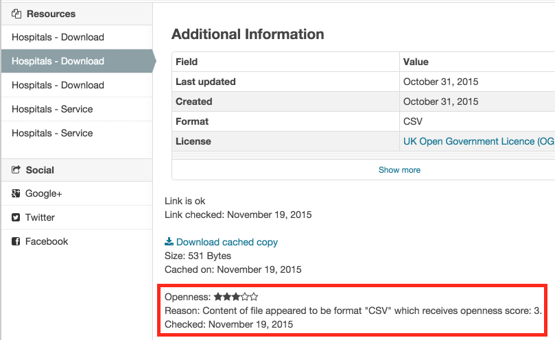

.. You should enable this project on travis-ci.org and coveralls.io to make
   these badges work. The necessary Travis and Coverage config files have been
   generated for you.

.. image:: https://travis-ci.org/datagovuk/ckanext-qa.svg?branch=master
    :target: https://travis-ci.org/datagovuk/ckanext-qa

CKAN QA Extension (Quality Assurance)
=====================================

The ckanext-qa extension will check each of your dataset resources in CKAN and give
them an 'openness score' based Tim Berners-Lee's five stars of openness
(http://lab.linkeddata.deri.ie/2010/star-scheme-by-example)

The openness score is displayed as stars on the dataset and resource pages.

.. image:: qa_dataset.png
    :alt: Stars on the dataset

It also provides a report that allows you to view the openness (stars ratings) across a publisher or across them all:

.. image:: qa_report.png
    :alt: Openness report (star ratings) for a publisher

Requirements
------------

Before installing ckanext-qa, make sure that you have installed the following:

* CKAN 2.1+
* ckanext-archiver 2.0+ (http://github.com/okfn/ckanext-archiver)

Installation
------------

To install ckanext-qa, ensure you have previously installed ckanext-archiver (v2.0+) and ckanext-report and then:

1. Activate your CKAN virtual environment, for example::

     . /usr/lib/ckan/default/bin/activate

2. Install the ckanext-qa Python package into your virtual environment::

     pip install -e git+http://github.com/okfn/ckanext-qa.git#egg=ckanext-qa

3. Install the qa dependencies::

     pip install -r ckanext-qa/requirements.txt

4. Now create the database tables::

     paster --plugin=ckanext-qa qa init --config=production.ini

5. Add ``qa`` to the ``ckan.plugins`` setting BEFORE ``archiver`` in your CKAN
   config file (by default the config file is located at
   ``/etc/ckan/default/production.ini``).

6. Restart CKAN. For example if you've deployed CKAN with Apache on Ubuntu::

     sudo service apache2 reload

Upgrade from version 0.1 to 2.x
-------------------------------

NB You should upgrade ckanext-archiver and ckanext-qa from v0.1 to 2.x in one go. Upgrade ckanext-archiver first and then carry out the following:

1. Activate your CKAN virtual environment, for example::

     . /usr/lib/ckan/default/bin/activate

2. Upgrade the ckanext-qa Python package::

     cd ckanext-qa
     git pull
     python setup.py develop

3. Create the new database tables::

     paster --plugin=ckanext-qa qa init --config=production.ini

4. Install the normal and developer dependencies::

     pip install -r requirements.txt
     pip install -r dev-requirements.txt

5. Migrate your database to the new QA tables::

     python ckanext/qa/bin/migrate_task_status.py --write production.ini

6. (Re)start the `paster celeryd2 run` processes described for ckanext-archiver.

Configuration
-------------

You must make sure that the following is set in your CKAN config::

    ckan.site_url = <URL to your CKAN instance>

Optionally you can configure a different set of scores to award each resource format::

    qa.resource_format_openness_scores_json = <filepath>

The default value is `resource_format_openness_scores.json`)

Using The QA Extension
----------------------

**QA**: score every dataset and resource against the 5 stars of openness.

The QA runs when a dataset/resource is archived, or you can run it manually using a paster command::

    paster --plugin=ckanext-qa qa update [dataset] --config=production.ini

Here ``dataset`` is a CKAN dataset name or ID, or you can omit it to do the QA on all datasets.

For a full list of manual commands run::

    paster --plugin=ckanext-qa qa --help

Once you've done some archiving you can generate an Openness report::

    paster --plugin=ckanext-report report generate openness --config=production.ini

And view it on your CKAN site at ``/report/openness``.

Tests
-----

To run the tests:

1. Activate your CKAN virtual environment, for example::

     . /usr/lib/ckan/default/bin/activate

2. If not done already, install the dev requirements::

    (pyenv)~/pyenv/src/ckan$ pip install ../ckanext-qa/dev-requirements.txt

3. From the CKAN root directory (not the extension root) do::

    (pyenv)~/pyenv/src/ckan$ nosetests --ckan ../ckanext-qa/tests/ --with-pylons=../ckanext-qa/test-core.ini

Questions
---------

The archiver info shows on the dataset/resource pages but the QA doesn't
~~~~~~~~~~~~~~~~~~~~~~~~~~~~~~~~~~~~~~~~~~~~~~~~~~~~~~~~~~~~~~~~~~~~~~~~

You need to ensure that in your ``ckan.plugins`` you have ``qa`` listed BEFORE ``archiver`` or else the template inheritance doesn't work and this happens.

