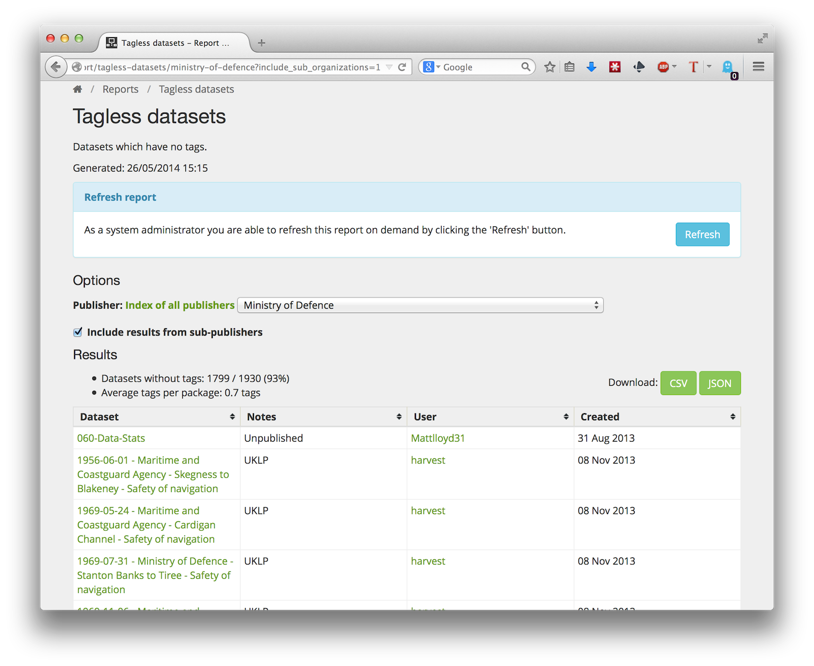

CKAN Report Extension
=======================

ckanext-report is a CKAN extension that provides a reporting infrastructure. Here are the features offered:

* All available reports are listed on a central web page and from the command-line.
* Breadcrumbs allow navigation from a report back to the reports page.
* Reports are served as a web page, JSON or CSV from a cache.
* The reports can be run in a nightly batch and saved to the cache.
* Admins can regenerate reports from the report's web page.

## Requirements

Before installing ckanext-report, make sure that you have installed the following:

* CKAN 2.3+
* ckanext-archiver (http://github.com/yhteentoimivuuspalvelut/ckanext-archiver)


## Install & setup

Install ckanext-report into your CKAN virtual environment in the usual way:

    (pyenv) $ pip install -e git+https://github.com/yhteentoimivuuspalvelut/ckanext-report.git

Initialize the database tables needed by ckanext-report:

    (pyenv) $ paster --plugin=ckanext-report report initdb --config=mysite.ini

Enable the plugin. In your config (e.g. development.ini or production.ini) add ``report`` to your ckan.plugins. e.g.:

    ckan.plugins = report

Get the list of reports:

    (pyenv) $ paster --plugin=ckanext-report report list --config=mysite.ini

Generate all reports:

    (pyenv) $ paster --plugin=ckanext-report report generate --config=mysite.ini

Generate a single report:

    (pyenv) $ paster --plugin=ckanext-report report generate <report name> --config=mysite.ini
 

Example report:



A number of extensions currently offer reports that rely on this extension, e.g. [ckanext-archiver](https://github.com/datagovuk/ckanext-archiver/blob/master/ckanext/archiver/reports.py), [ckanext-qa](https://github.com/datagovuk/ckanext-qa/blob/master/ckanext/qa/reports.py).


## Command-line interface

The following operations can be run from the command line using the ``paster --plugin=ckanext-report report`` command:

```
  report list
    - lists the reports

  report generate [report1,report2,...]
    - generate the specified reports, or all of them if none specified
```

e.g.:

    (pyenv) $ paster --plugin=ckanext-report report list --config=mysite.ini


## Demo report - Tagless Datasets

There is a simple demonstration report included in ckanext-report which you can enable by adding `tagless_report` to your list of `ckan.plugins` in your ckan.ini. Once you've restarted paster or whichever webserver, you should see it listed on the webpage at: `/report`.


## Dataset Notes

Reports that examine datasets include a column 'Dataset Notes', designed to show custom properties of the datasets. There are often key properties that you want to show, such as whether a dataset is private, harvested etc., but it is configurable because every CKAN install is different. To configure the contents of this: put a python expression in the CKAN config `ckanext-report.notes.dataset`.

For example at data.gov.uk we flag up if a dataset is 'unpublished', has been harvested or was imported from ONSHUB:

```
ckanext-report.notes.dataset = ' '.join(('Unpublished' if asbool(pkg.extras.get('unpublished')) else '', 'UKLP' if asbool(pkg.extras.get('UKLP')) else '', 'National Statistics Pub Hub' if pkg.extras.get('external_reference')=='ONSHUB' else ''))
```

# Creating a Report

A report has three key elements:

1. Report Code - a python function that produces the report. 
2. Template - HTML for displaying the report data.
3. Registration - containing the configuration of the report.

The examples below are taken from the worked example "Tagless datasets" in this repository - see above for how to run this demo.

This extension uses its own CSS rather than core CKAN's, thus requires CSS addition for further customization. For an example, see this branch: see https://github.com/yaditi/ckanext-report/tree/geoversion


## Report Code

The code that produces the report will probably make some calls to the logic layer or database, assemble the data into dicts/lists and then return them. This will be saved as JSON in the database data_cache.

The returned data should be a dict like this:

```javascript
{
    'table': [
        {'name': 'river-levels', 'title': 'River levels', 'notes': 'Harvested', 'user': 'bob', 'created': '2008-06-13T10:24:59.435631'},
        {'name': 'co2-monthly', 'title' 'CO2 monthly', 'notes': '', 'user': 'bob', 'created': '2009-12-14T08:42:45.473827'},
    ],
    'num_packages': 56,
    'packages_without_tags_percent': 4,
    'average_tags_per_package': 3.5,
}
```
  
There should be a `table` with the main body of the data, and any other totals or incidental pieces of data.

Note: the table is required because of the CSV download facility, and CSV demands a table. (The CSV download only includes the table, ignoring any other values in the data.) Although the data has to essentially be stored as a table, you do have the option to display it differently in the web page by using a clever template.

Dates should be returned as an ISO format string.

The convention is to put the report code in: `ckanext/<extension>/reports.py`

## Template

When you view a report, ckanext-report will automatically show the title, options, the CSV/JSON download buttons and for the administrator a 'refresh' button. Everything below that, the display of the data itself, is the job of the report template.

The report template will probably display the incidental data and then the table:

```html
{#
Report (snippet)

table - main data, as a list of rows, each row is a dict
data - other data values, as a dict
#}
<ul>
    <li>Datasets without tags: {{ table|length }} / {{ data['num_packages'] }} ({{ data['packages_without_tags_percent'] }})</li>
    <li>Average tags per package: {{ data['average_tags_per_package'] }} tags</li>
</ul>

<table class="table table-bordered table-condensed tablesorter" id="report-table" style="width: 100%; table-layout:fixed; margin-top: 8px;">
    <thead>
      <tr>
        <th>Dataset</th>
        <th>Notes</th>
        <th>User</th>
        <th>Created</th>
      </tr>
    </thead>
    <tbody>
      
        <tr>
          <td>
            <a href="{{ h.url_for(controller='package', action='view', id=row.name) }}">
              {{ row.title }}
            </a>
          </td>
          <td>{{ row.notes }}</td>
          <td>{{ h.linked_user(row.user) }}</td>
          <td>{{ h.render_datetime(row.created) }}</td>
        </tr>
      
    </tbody>
</table>
```

The convention is to put the report templates in: `ckanext/<extension>/templates/report/<report_name>.html`

Note: currently ckanext-report has not been styled yet for the core CKAN templates, due to the author using custom templates. Feel free to add styling.

## Registration

Register your report with ckanext-report with the IReport plugin and supply its configuration.

Your extension will probably have a file `plugin.py` defining plugins - classes which inherit from `p.SingletonPlugin`. Make a plugin implement IReport, based on this example plugin.py:

```python
import ckan.plugins as p
from ckanext.report.interfaces import IReport

class TaglessReportPlugin(p.SingletonPlugin):
    p.implements(IReport)

    # IReport

    def register_reports(self):
        import reports
        return [reports.tagless_report_info]
```

The last line refers to `tag_report_info` which is a dictionary with properties of the report. This is stored in `reports.py` together with the report code (see above). The info dict looks like this:

```python
from ckan.lib.helpers import OrderedDict
tagless_report_info = {
    'name': 'tagless-datasets',
    'description': 'Datasets which have no tags.',
    'option_defaults': OrderedDict((('organization', None),
                                    ('include_sub_organizations', False),
                                    )),
    'option_combinations': tagless_report_option_combinations,
    'generate': tagless_report,
    'template': 'report/tagless.html',
    }
```

Info dict spec:

* name - forms part of the URL
* title (optional) - this is the report title as it is displayed. Defaults to name, capitalized and with dashes changed to spaces.
* description (optional) - this is displayed in the report list page and on the report page.
* generate - function returning the report data
* template - filepath of the report HTML template
* option_defaults - dict of ALL option names and their default values. Use ckan.common.OrderedDict. If there are no options, you can return None.
* option_combinations - function returning a list of all the options combinations (reports for these combinations are generated by default). If there are no options, return None.
* authorize (optional) - a function that says if the user is allowed to view the report. Takes params: (user_object, options_dict) and should return a boolean - if the user is authorized or not. The default is that anyone can see reports.

Finally we need to define the function that returns the option_combinations:
```python
def tagless_report_option_combinations():
    for organization in lib.all_organizations(include_none=True):
        for include_sub_organizations in (False, True):
            yield {'organization': organization,
                   'include_sub_organizations': include_sub_organizations}
```

## TODO:

* Stop a report from being generated multiple times in parallel (unnecessary waste) - use a queue?
* Stop more than one report being generated in parallel (high load for the server) - maybe use a queue

Author(s): David Read

